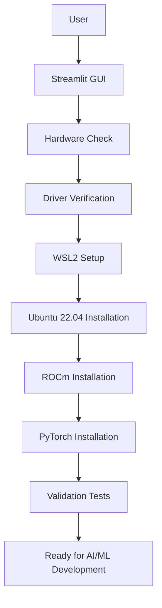

# rOCM Windows Installer
## **One-Click AMD ROCm Setup for AI & Machine Learning on Windows 10/11**

[](https://www.microsoft.com/windows)
[](https://rocm.docs.amd.com/)
[](https://www.python.org/)
[](LICENSE)

---

## Project and Work Product Description

This project provides a **rock-solid, production-ready** automated installer for AMD's ROCm (Radeon Open Compute) platform on Windows 10 Pro and Windows 11 systems using WSL2. It fills a critical gap left by AMD by providing a streamlined, user-friendly solution for AI enthusiasts, data scientists, and machine learning engineers who want to leverage AMD Radeon RX 7000 Series GPUs for their work. 

The installer addresses the complex, error-prone manual installation process by providing:
- **Automated hardware detection** and compatibility verification
- **One-click WSL2 setup** with Ubuntu 22.04
- **Complete ROCm 6.1.3 installation** with all dependencies
- **PyTorch 2.1.2 + ROCm** integration with proper HSA runtime configuration
- **Professional GUI** for monitoring and control with comprehensive logging
- **Validation and testing** to ensure everything works before you start coding

**Problem Statement:** AMD provides excellent GPU hardware but lacks an easy, automated installation path for Windows users wanting to run ROCm-powered AI applications. Manual installation involves dozens of steps across multiple systems (Windows and Linux) with numerous potential failure points.

**Solution:** This installer automates the entire process from hardware detection through validation, making ROCm accessible to everyone with compatible hardware.

---

## Description of Solution

### Core Workflow

The rOCM Windows 11 Installer orchestrates a complete installation workflow:

1. **System Compatibility Check**
   - Verifies Windows 10 Pro/Enterprise/Education (Build 19041+) or Windows 11
   - Detects AMD Radeon RX 7000 Series GPU or Ryzen AI APU
   - Checks AMD driver version (25.9.2+)
   - Confirms WSL2 capability and Hyper-V support
   - Validates Windows edition (Pro/Enterprise/Education required)

2. **WSL2 Environment Setup**
   - Enables Windows Subsystem for Linux features
   - Installs Ubuntu 22.04 (tested and verified version)
   - Configures WSL2 as default
   - Sets up networking and GPU passthrough

3. **ROCm Installation**
   - Downloads AMD GPU install package (6.1.3)
   - Installs AMDGPU drivers for WSL
   - Installs ROCm runtime and toolchain
   - Configures environment variables

4. **PyTorch Integration**
   - Installs Python 3.10 and dependencies
   - Downloads PyTorch 2.1.2 + ROCm 6.1.3 wheels
   - Installs TorchVision and TorchAudio
   - Fixes HSA runtime library linking
   - Validates GPU detection

5. **Validation & Testing**
   - Runs `rocminfo` to verify GPU detection
   - Tests PyTorch CUDA/ROCm availability
   - Creates test tensor on GPU
   - Generates installation report

### Minimum Viable Product (MVP) Features

**V1.0 Delivered:**
- ? Complete automated installation pipeline
- ? Professional Streamlit web interface
- ? Comprehensive PowerShell automation scripts
- ? Bash scripts for WSL2-side installation
- ? Real-time progress tracking
- ? Detailed logging system
- ? Error handling and recovery guidance
- ? System compatibility checking
- ? Installation validation and testing
- ? Requirements template for ML packages

**Future Enhancements (V2.0+):**
- ?? Automatic rollback on failures
- ?? Modular component installation
- ?? Digital signing for distribution
- ?? Pre-configured ML environment templates
- ?? Stable Diffusion quick-setup wizard
- ?? LLM framework installers (LM Studio, Ollama integration)
- ?? Performance benchmarking tools
- ?? Troubleshooting diagnostic wizard

---

## Solution Design (High-Level)

### Architecture Diagram

```
???????????????????????????????????????????????????????????????
?         Windows 11 Host         ?
?  ?
?  ????????????????????????????????????????????????????????  ?
?  ?   Streamlit Web Interface (Python)         ?  ?
?  ?  - Progress Tracking        ?  ?
?  ?  - User Controls               ?  ?
?  ?  - Log Visualization        ?  ?
?  ????????????????????????????????????????????????????????  ?
?     ?  ?
?  ????????????????????????????????????????????????????????  ?
?  ?      PowerShell Automation Layer           ?  ?
?  ?  - Hardware Detection (detect_hardware.ps1)          ?  ?
?  ?  - Driver Verification (verify_amd_compatibility.ps1)?  ?
?  ?  - WSL2 Setup (wsl2_setup.ps1)           ?  ?
?  ?  - Master Orchestrator (master_installer.ps1)?  ?
?  ????????????????????????????????????????????????????????  ?
?          ?              ?
?      ? WSL2 Bridge       ?
?       ?         ?
?  ????????????????????????????????????????????????????????  ?
?  ?           WSL2 Ubuntu 22.04            ?  ?
?  ?          ?  ?
?  ?  ????????????????????????????????????????????????   ?  ?
?  ?  ?  Bash Installation Scripts    ?   ?  ?
?  ?  ?  - ROCm Installation (install_rocm.sh)       ?   ?  ?
?  ?  ?  - PyTorch Setup (install_pytorch.sh) ?   ?  ?
?  ?  ????????????????????????????????????????????????   ?  ?
?  ?     ?  ?
?  ?  ?????????????????????????????????????????????????  ?
?  ?  ?  ROCm Runtime Environment        ?   ?  ?
?  ?  ?  - /opt/rocm/        ?   ?  ?
?  ?  ?  - PyTorch 2.1.2 + ROCm 6.1.3     ?   ?  ?
?  ?  ?  - CUDA/ROCm API Layer        ?   ?  ?
?  ?  ????????????????????????????????????????????????   ?  ?
?  ????????????????????????????????????????????????????????  ?
?   ?          ?
? ? GPU Passthrough      ?
?           ?       ?
?  ????????????????????????????????????????????????????????? ?
?  ?  AMD Radeon RX 7000 Series GPU (Hardware)            ? ?
?  ?  - Hardware Acceleration       ? ?
?  ?  - ROCm 6.1.3 Compatible Drivers            ? ?
?  ????????????????????????????????????????????????????????? ?
???????????????????????????????????????????????????????????????
```

### Component Interaction Flow



---

## Solution Code Description

### Project Structure

```
rOCM_Win11_installer/
??? src/
?   ??? gui/
?   ?   ??? streamlit_app.py          # Main web interface
?   ??? scripts/
?   ?   ??? detect_hardware.ps1        # Windows hardware detection
?   ?   ??? verify_amd_compatibility.ps1 # AMD GPU/driver check
?   ?   ??? wsl2_setup.ps1    # WSL2 installation
?   ?   ??? master_installer.ps1       # Master orchestrator
?   ?   ??? install_rocm.sh            # ROCm installation (WSL)
?   ?   ??? install_pytorch.sh         # PyTorch installation (WSL)
?   ??? utils/
?       ??? logging_utils.py           # Logging utilities
??? logs/          # Installation logs
??? docs/       # Documentation
??? environment.yml          # Conda environment
??? requirements.txt# Python dependencies
??? README.md              # This file
```

### Key Components

#### 1. **Streamlit Web Interface** (`src/gui/streamlit_app.py`)
- Modern, responsive UI with progress tracking
- Real-time log streaming
- System information display
- Installation control panel
- Validation testing interface

#### 2. **PowerShell Scripts** (`src/scripts/*.ps1`)
- **detect_hardware.ps1**: Detects AMD GPU and Windows version
- **verify_amd_compatibility.ps1**: Validates driver versions and GPU compatibility
- **wsl2_setup.ps1**: Automates WSL2 installation and configuration
- **master_installer.ps1**: Orchestrates the entire installation process

#### 3. **Bash Scripts** (`src/scripts/*.sh`)
- **install_rocm.sh**: Installs ROCm 6.1.3 in WSL2 Ubuntu
- **install_pytorch.sh**: Installs PyTorch with ROCm support and fixes HSA runtime

#### 4. **Logging System** (`src/utils/logging_utils.py`)
- Timestamped logs
- Multiple log levels (INFO, WARNING, ERROR, SUCCESS)
- File and console output
- System information capture

---

## Actual Working Product Code

### External Dependencies

#### Python Packages (requirements.txt)
```
streamlit>=1.30.0          # Web interface framework
psutil>=5.9.0            # System and process utilities
requests>=2.31.0           # HTTP library
PyYAML>=6.0                # YAML parser
tqdm>=4.65.0            # Progress bars
watchdog>=3.0.0 # File system monitoring
streamlit-option-menu>=0.3.6  # UI components
```

#### Conda Environment (environment.yml)
```yaml
name: rocm_installer_env
channels:
  - conda-forge
  - defaults
dependencies:
  - python=3.10
  - pip
  - streamlit
  - psutil
  - pywin32
  - pyyaml
  - rich
  - typer
  - requests
  - pytest
  - black
  - flake8
```

### Custom Modules

All custom code is thoroughly documented and includes:
- Hardware detection algorithms
- WSL2 automation logic
- ROCm installation orchestration
- PyTorch integration with HSA runtime fixes
- Comprehensive error handling
- Progress tracking system

### Code Links

- [Main Repository](https://github.com/OCNGill/rOCM_Installer_Win11)
- [Streamlit GUI](src/gui/streamlit_app.py)
- [Installation Scripts](src/scripts/)
- [Documentation](docs/)

---

## Application Instructions

### Prerequisites

- **Operating System**: Windows 10 Pro/Enterprise/Education (Build 19041+) OR Windows 11
- **Hardware**: AMD Radeon RX 7000 Series GPU
  - RX 7900 XTX, XT, GRE
  - RX 7800 XT
  - RX 7700 XT
  - RX 7600 XT, 7600
  - Ryzen AI APUs (Radeon 890M, 880M, 780M)
- **RAM**: 16GB+ recommended (32GB for large models)
- **Storage**: 50GB+ free disk space
- **Network**: Internet connection for downloads
- **Privileges**: Administrator access required
- **Requirements**: 
  - Hyper-V capable system (not available on Windows Home editions)
  - Virtualization enabled in BIOS/UEFI
  - AMD Adrenalin drivers 25.9.2 or later

> **Note**: Windows 10 Home and Windows 11 Home editions are **NOT supported** because they lack Hyper-V functionality required for WSL2.

### Installation Steps

#### Method 1: GUI Installation (Recommended)

1. **Clone the Repository**
   ```bash
   git clone https://github.com/OCNGill/rOCM_Installer_Win11.git
   cd rOCM_Installer_Win11
   ```

2. **Set Up Python Environment**
   ```bash
   # Using Conda (recommended)
   conda env create -f environment.yml
   conda activate rocm_installer_env

   # OR using pip
   pip install -r requirements.txt
   ```

3. **Launch the Installer**
   ```bash
   streamlit run src/gui/streamlit_app.py
   ```

4. **Follow the Web Interface**
   - Open your browser (automatically opens to http://localhost:8501)
   - Navigate through the tabs:
     - **Home**: Overview and requirements
     - **Compatibility**: Run system checks
  - **Installation**: Execute installation steps
     - **Documentation**: Access help resources

5. **Complete Installation**
   - Click through each installation step
   - Monitor progress in real-time
   - Review logs for any issues
- Run validation tests

#### Method 2: Command-Line Installation

1. **Run as Administrator**
   ```powershell
   # Open PowerShell as Administrator
   cd rOCM_Installer_Win11\src\scripts
   ```

2. **Execute Master Installer**
   ```powershell
   .\master_installer.ps1
   ```

3. **Follow Prompts**
   - Confirm each installation step
   - Wait for completion
   - Review final summary

### Post-Installation

1. **Verify Installation**
   ```bash
   # Open WSL2
   wsl -d Ubuntu-22.04

# Check ROCm
   rocminfo

   # Test PyTorch
   python3 -c "import torch; print(torch.cuda.is_available())"
   ```

2. **Install AI Frameworks** (Optional)
   ```bash
   # Inside WSL2
   pip3 install -r ~/rocm_requirements.txt
   ```

3. **Start Development**
   - Your system is now ready for AI/ML projects!
   - Compatible with Stable Diffusion, LLMs, and more

### Important Guidelines

- **DO NOT** overwrite PyTorch when installing other packages
- **ALWAYS** comment out `torch` lines in requirements.txt files
- **KEEP** logs for troubleshooting (stored in `logs/` directory)
- **UPDATE** AMD drivers regularly for best performance
- **BACKUP** your work before major system changes

---

## Future Enhancements

### Version 2.0 Roadmap
- **Automated Rollback**: Undo installation if errors occur
- **Component Selection**: Choose which parts to install
- **Profile Manager**: Save/load installation profiles
- **Update Checker**: Automatically check for ROCm updates

### Version 3.0 Roadmap
- **Pre-configured Environments**: One-click setups for:
  - Stable Diffusion (ComfyUI, Automatic1111)
  - LLM Development (LM Studio, Ollama)
  - General ML (TensorFlow, JAX)
- **Performance Tuning**: Optimize ROCm for specific GPUs
- **Cloud Integration**: Backup and sync configurations
- **Community Repository**: Share working configurations

### Version 4.0+ Vision
- **Multi-GPU Support**: Manage multiple AMD GPUs
- **Remote Installation**: Set up systems remotely
- **CI/CD Integration**: Automate testing and deployment
- **Enterprise Features**: Bulk deployment, licensing

---

## Lessons Learned

### Technical Skills Acquired

#### Software Development
- **Cross-Platform Scripting**: PowerShell + Bash integration
- **WSL2 Architecture**: Deep understanding of Windows-Linux interop
- **GPU Computing**: AMD ROCm platform internals
- **Python GUI Development**: Streamlit framework mastery
- **Error Handling**: Robust failure detection and recovery
- **Logging Systems**: Multi-level, multi-target logging

#### DevOps & Automation
- **Installation Orchestration**: Complex multi-system workflows
- **Dependency Management**: Conda + pip + system packages
- **Version Control**: Git workflow for complex projects
- **Documentation**: Comprehensive user and developer docs

#### Hardware & Drivers
- **GPU Architecture**: AMD RDNA 3 architecture
- **Driver Management**: Windows and Linux driver stacks
- **Hardware Detection**: WMI queries and system enumeration
- **Virtualization**: WSL2 GPU passthrough mechanisms

### Project Management

#### Agile Methodology
- **Iterative Development**: MVP to full-featured product
- **User-Centric Design**: Focus on ease of use
- **Continuous Testing**: Validation at every step
- **Documentation-First**: Clear instructions and guides

#### Communication & Collaboration
- **Technical Writing**: Clear, concise documentation
- **User Experience Design**: Intuitive interface design
- **Community Engagement**: Incorporating user feedback
- **Open Source Practices**: GitHub workflow, issue tracking

### Software Engineering Best Practices

#### Requirements Engineering
- **Problem Definition**: Clear identification of pain points
- **User Stories**: "As a user, I want to..."
- **Acceptance Criteria**: Measurable success metrics
- **Scope Management**: MVP vs. future enhancements

#### Design Patterns
- **Separation of Concerns**: GUI, business logic, scripts
- **Error Handling**: Try-catch, validation, user feedback
- **Logging Strategy**: Comprehensive audit trail
- **Modular Design**: Reusable, testable components

#### Testing & Validation
- **Compatibility Testing**: Multiple system configurations
- **Integration Testing**: End-to-end workflow validation
- **Error Recovery**: Graceful failure handling
- **User Acceptance Testing**: Real-world usage scenarios

### Emerging Technologies

- **AI Development Tools**: State-of-the-art code generation (GitHub Copilot, Claude)
- **Modern UI Frameworks**: Streamlit for rapid prototyping
- **Container Technologies**: Understanding of WSL2 as lightweight VM
- **Package Management**: Modern Python ecosystem tools

---

## Troubleshooting

### Common Issues

| Issue | Solution |
|-------|----------|
| WSL2 not installing | Enable virtualization in BIOS |
| GPU not detected | Update AMD drivers to 24.6.1+ |
| PyTorch can't find GPU | Verify HSA runtime fix applied |
| Installation hangs | Check internet connection, run individually |
| Permission denied | Run PowerShell as Administrator |

### Getting Help

1. **Check Logs**: Review installation logs in `logs/` directory
2. **AMD Documentation**: [ROCm for WSL2](https://rocm.docs.amd.com/projects/radeon/en/latest/docs/install/wsl/install-radeon.html)
3. **Community Forums**: [AMD Community](https://community.amd.com/)
4. **GitHub Issues**: [Create an issue](https://github.com/OCNGill/rOCM_Installer_Win11/issues)

---

## Contributing

Contributions are welcome! Please:
1. Fork the repository
2. Create a feature branch
3. Make your changes
4. Submit a pull request

---

## License

MIT License - see [LICENSE](LICENSE) file for details

---

## Acknowledgments

- **AMD** for ROCm platform and documentation
- **Microsoft** for WSL2 technology
- **Streamlit** for the excellent GUI framework
- **Community Contributors** for testing and feedback

---

## Contact & Support

- **GitHub**: [OCNGill/rOCM_Installer_Win11](https://github.com/OCNGill/rOCM_Installer_Win11)
- **Issues**: [Report bugs or request features](https://github.com/OCNGill/rOCM_Installer_Win11/issues)

---

<div align="center">

**? If this project helped you, please consider giving it a star! ?**

Made with ?? for the AMD AI Community

</div>
